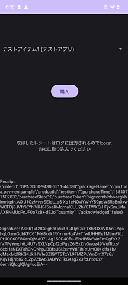

# AndroidPayment

AndroidのIABにおいて、他アプリのレシートと入れ替えると通ってしまうという脆弱性が存在する。
このアプリは、簡単にレシートを取得できるアプリなので、アプリのIABのレシート偽装の脆弱性の診断に便利です。
対策は、ちゃんとレシートの `packageName` を確認することです。

## 使い方

1. `Google Play Console` にログインして、アプリを登録する（アプリIDを `com.funa.paymentsample` とする)
2. `Google Play Console`の商品で、攻撃対象のアプリで販売されているアイテムと同じアイテムIDのアイテムを作成する
    1. 例： `powerup.item.100`
3. 本アプリの `app/build.gradle` の `applicationId` を `com.funa.paymentsample` とする
4. 本アプリの `app/src/main/java/com/funa/androidpayment/MainActivity.kt` の `procuctIds` 配列に、先ほど `Google Play Console` で登録したアイテムID(`powerup.item.100`)を追記する。
5. Android Studioでプロジェクトを開き、ビルド・実行する
6. アプリのリストボックスから先ほど登録した商品名を選択し、購入ボタンをタップする
7. するとアプリ画面にレシートが表示される。レシートはログにも出力されているので、PCに取り込みたい時は `adb logcat` で取得する

